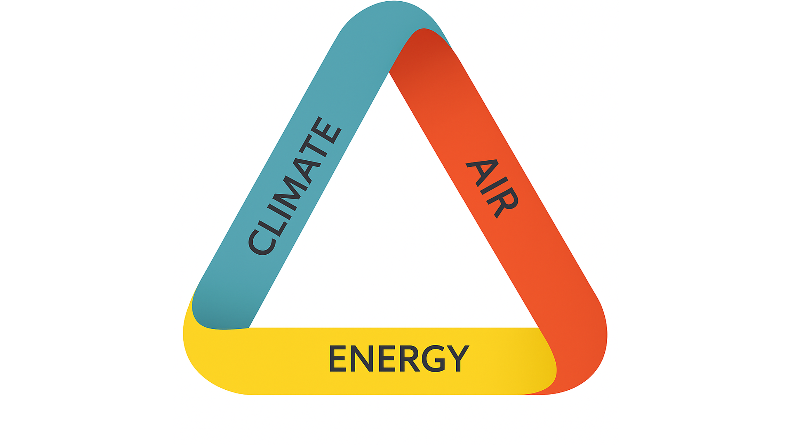
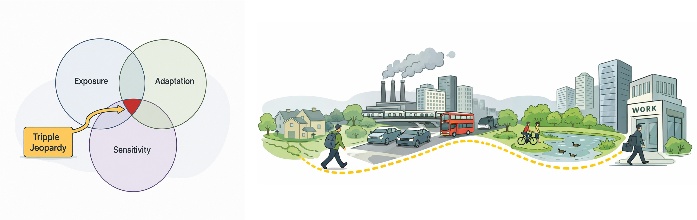
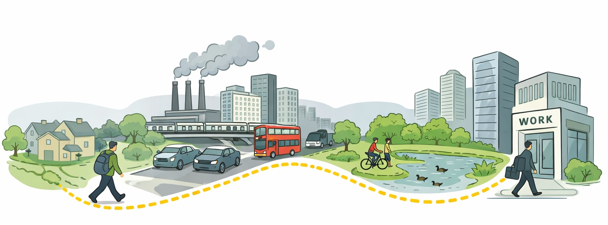
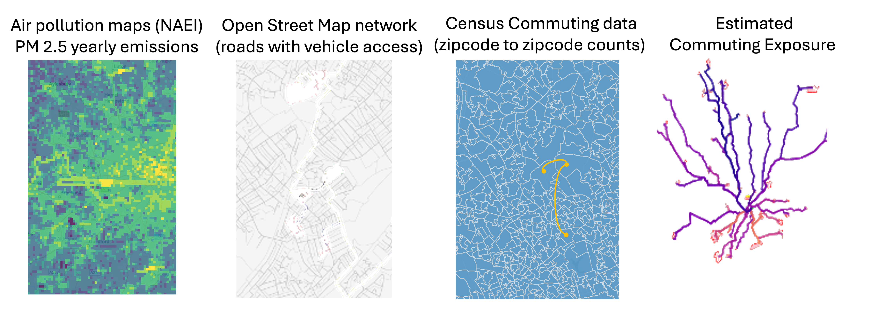
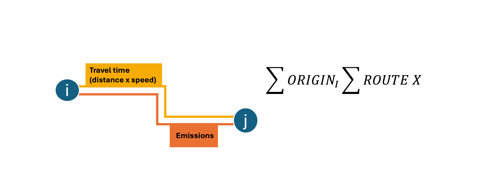
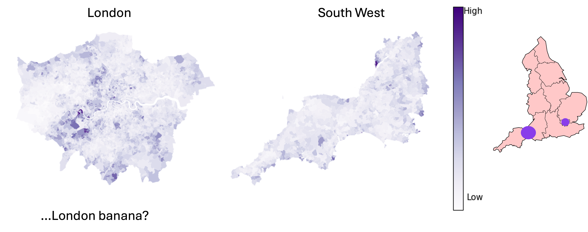
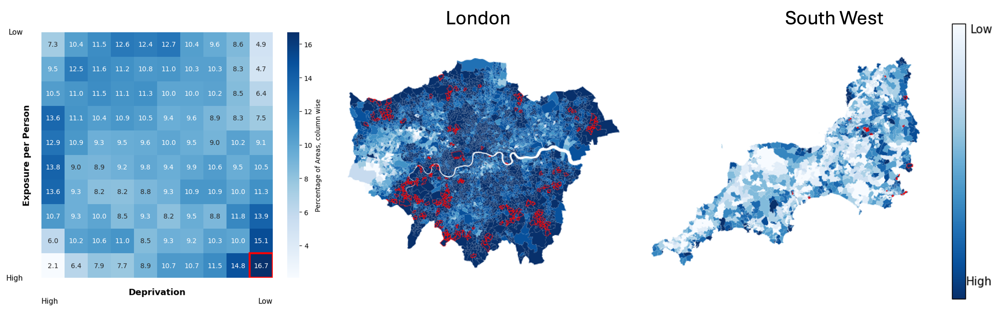
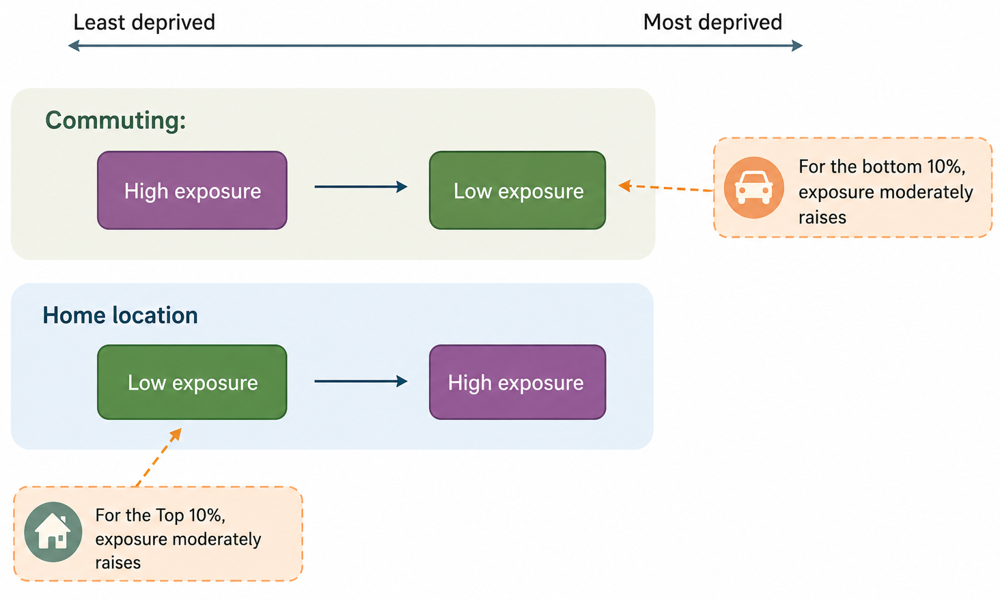
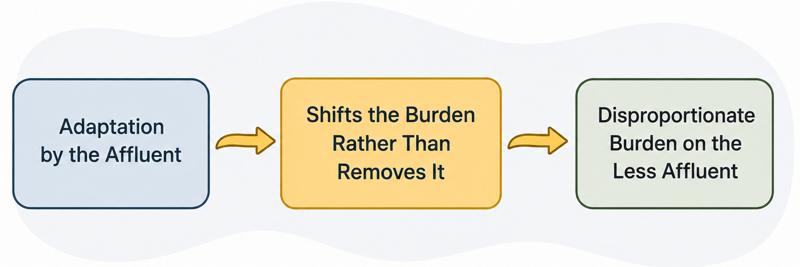

# Mapping Ambient Vulnerabilities

*Lenka Hasova*  
Quantitative Spatial Science group
Department of Geographical Sciences
University of Bristol

<i class="fa-brands fa-linkedin"></i> [LinkedIn](https://linkedin.com/in/yourprofile)

<i class="fa-brands fa-github"></i> [GitHub](https://github.com/yourprofile)

<i class="fa-solid fa-envelope"></i> [email@example.com](mailto:email@example.com)

 #
 #
 #
 #

            

 

Website: [ambient-vulnerability.co.uk](https://ambient-vulnerability.co.uk/)

----

## Air Quality **vulnerability** through peoples lives

**3 parts**: exposure, sensitivity, and adaptability makes upvulnerability
**3 stages**: it home, on the move, at work
**3 outputs**: journal article policy briefing, interactive online outputs

#

 

------

## **Exposure** to air pollution on the move
 

 

------
## What

Large scale research is limited to fixed locations.

We use national scale simulation of population commutes to understand the dinamic

-------

## How
Routing with [Pandana](https://udst.github.io/pandana/) is the core, rest is just GIS

------
k
k
k
k
k

-------

## Results

#### Pm2.5 exposure per journey per commuter **within** the region
-------

## Results

#### Deprivation deciles paired with the exposure deciles across **whole England**
-------

## Implications

##### Paired with our [previous study](https://journals.sagepub.com/doi/10.1177/23998083251344678) 

----

* ###### Deprivation is generally concentrated in urban areas.
* ###### Rural areas are often perceived as cleaner, safer, and more spacious, which can make properties more expensive.
* ###### Public transport access in rural areas is often limited
* ###### Choosing a rural location can be viewed as an adaptation strategy, trading accessibility and transport convenience for environmental and residential benefits.

 

###### Walking to work, [your pm2.5 intake is higher than if commuting in car](https://www.sciencedirect.com/science/article/pii/S2214140522000378).

-------

# Future steps

* Explore in details the connection betveen high exposure, population socio-economics and the properties of the joureys.
* Relate the findings to teh ideas of distributed justice = what is "fair" and how can policy support that alongisde improving the pollution in the country overall 

----

# Thank you!....questions?

            

Website: [ambient-vulnerability.co.uk](https://ambient-vulnerability.co.uk/)

